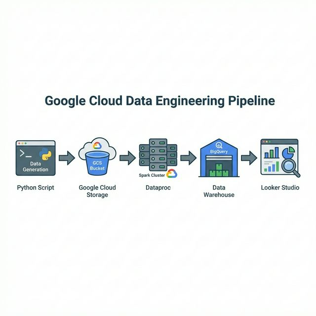

# eSIM Data Analytics Pipeline on GCP

This project demonstrates a complete Data Engineering pipeline on Google Cloud Platform (GCP) to analyze eSIM lifecycle events.

## 🎯 Goal
Ingest, process, and analyze eSIM data (Orders, Activations, Usage) to calculate Key Performance Indicators (KPIs) such as **Activation Success Rate** and **Provisioning Time**.

## 🏗 Architecture


1.  **Ingestion**: Python script generates synthetic CSV data.
2.  **Storage**: Data is uploaded to **Cloud Storage (GCS)**.
3.  **Processing**: **Apache Spark** job (Scala) on **Cloud Dataproc** processes data and calculates KPIs.
4.  **Warehousing**: Results are loaded into **BigQuery** for analysis.
5.  **Visualization**: Dashboard in **Looker Studio** (optional).

## 📊 Data Schema

### Table: `daily_kpis`
Tracks daily performance metrics.

| Column Name | Type | Description |
| :--- | :--- | :--- |
| `date` | DATE | The date of the stored KPIs. |
| `total_orders` | INTEGER | Total number of eSIM orders received. |
| `successful_activations` | INTEGER | Number of orders successfully activated. |
| `avg_provisioning_time_sec` | FLOAT | Average time (seconds) taken for provisioning. |
| `success_rate` | FLOAT | Percentage of successful activations (`successful / total * 100`). |

### Table: `device_stats`
Analyzes performance by device model.

| Column Name | Type | Description |
| :--- | :--- | :--- |
| `device_model` | STRING | Name of the device (e.g., "iPhone 15", "Pixel 8"). |
| `total_orders` | INTEGER | Total orders for this device model. |
| `successful_activations` | INTEGER | Successful activations for this model. |
| `failure_rate` | FLOAT | Percentage of failed activations. |


## 🛠 Tech Stack
-   **Language**: Scala (Spark), Python (Data Gen)
-   **GCP Services**: GCS, Dataproc, BigQuery
-   **Tools**: SBT, gcloud CLI

## 🚀 How to Run

### Prerequisites
-   GCP Project with Billing enabled.
-   `gcloud` CLI installed and authenticated.
-   `sbt` installed.

### 1. Generate Data (Optional)
If you want to generate fresh synthetic data, run the Python script:
```bash
# Ensure you have pandas installed (pip install pandas)
python3 data/generate_esim_data.py
```

### 2. Build & Deploy
Use the helper script to create infrastructure (Bucket, Dataproc, BigQuery), upload the code/data, and submit the Spark job:

```bash
# Update PROJECT_ID in scripts/deploy_and_run.sh before running!
sh scripts/deploy_and_run.sh
```

### 3. Check Results (BigQuery)
Go to BigQuery Console and query the `esim_analytics.daily_kpis` table:

```sql
SELECT * FROM esim_analytics.daily_kpis ORDER BY date DESC;
```

## 🧹 Cleanup
To avoid billing charges, run the cleanup script to delete the infrastructure:
```bash
sh scripts/cleanup.sh
```
